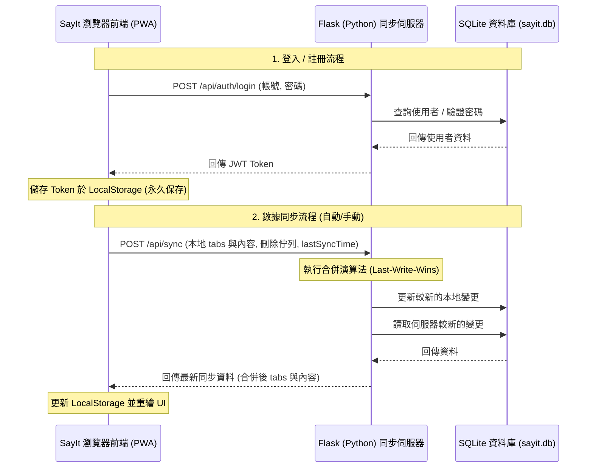

# Implementation Plan - Flask + SQLite 數據庫同步功能

本計畫旨在為 **SayIt** 引進「SQLite 數據庫同步功能」。後端將改為使用 **Flask (Python) + SQLite** 架構。使用者只需在瀏覽器中輸入一次帳號與密碼，系統即會將憑證（JWT Token）永久儲存在瀏覽器中，並在背景自動完成多端資料同步。

## 🎯 系統架構設計 (Architecture)

我們將採用 **Client-Server** 架構來實作資料同步：
1.  **後端 (Server)**:
    *   使用 Python + Flask 建立輕量化同步服務。
    *   使用 Python 內建的 `sqlite3` 本地資料庫儲存使用者資料與分頁筆記。
    *   使用 `werkzeug.security` 進行安全密碼雜湊，`PyJWT` 進行身分驗證。
2.  **前端 (Client - PWA)**:
    *   新增 `sync-service.js` 控制器，處理登入/註冊 API 呼叫、LocalStorage 同步邏輯。
    *   新增 `syncDialog` 供使用者輸入帳密與伺服器位址，並在 `topbar` 增加 🔄 同步狀態圖示。
    *   與 `app.js` 進行橋接，當編輯存檔、新增/修改/刪除分頁時，自動觸發背景同步。



---

## 💾 資料庫綱要 (Database Schema)

在 `sayit.db` 中建立兩張資料表：

### 1. `users` (使用者資料表)
*   `id`: `INTEGER PRIMARY KEY AUTOINCREMENT`
*   `username`: `TEXT UNIQUE` (不允許重複)
*   `password_hash`: `TEXT` (密碼雜湊值)
*   `created_at`: `INTEGER` (建立時間戳記)

### 2. `tabs` (分頁與內容資料表)
*   `user_id`: `INTEGER` (關聯到 `users.id`)
*   `tab_id`: `TEXT` (對應前端分頁 ID)
*   `name`: `TEXT`
*   `color`: `TEXT`
*   `eyebrow`: `TEXT`
*   `placeholder`: `TEXT`
*   `language`: `TEXT`
*   `code_theme`: `TEXT`
*   `content`: `TEXT` (該分頁的筆記內文)
*   `updated_at`: `INTEGER` (毫秒時間戳記，用於衝突判定)
*   *主鍵*: `PRIMARY KEY (user_id, tab_id)`

---

## 🔄 同步合併演算法 (Sync & Conflict Algorithm)

每次 `POST /api/sync` 觸發時：
1.  **處理本地刪除**：伺服器遍歷用戶端傳來的 `deletedTabIds` 列表，從資料庫中將其刪除。
2.  **更新雲端**：遍歷用戶上傳的 `tabs` 列表，若該分頁在資料庫中不存在，或者 `client.updatedAt > server.updated_at`，則將用戶端資料覆寫/插入至資料庫中。
3.  **拉取雲端更新**：讀取伺服器上該用戶的所有分頁。
    *   若該分頁在本次用戶端上傳列表中**不存在**：
        *   若用戶端傳來的 `lastSyncTime` 是 `0` (首次同步或重設)，或者伺服器上該分頁 `updated_at > lastSyncTime`，說明此分頁在其他裝置被新增或更新過，應將其加入 `updatedTabs` 回傳給用戶端。
        *   若該分頁的 `updated_at <= lastSyncTime`，說明用戶端在離線或上次同步後將其刪除了，因此伺服器應將其從資料庫中刪除，並加入 `deletedTabIds` 回傳。
    *   若該分頁在本次用戶端上傳列表中**存在**：
        *   若伺服器上該分頁 `updated_at > client.updatedAt`（例如其他裝置的更新版本已經在稍早同步到雲端），應將伺服器最新的內容放入 `updatedTabs` 回傳。
4.  **回傳結果**：回傳最新同步時間與需要用戶端更新/刪除的列表。

---

## 🛠️ 預計修改內容 (Proposed Changes)

### 📂 後端服務 (New Directory: `server/`)

#### [NEW] `server/requirements.txt`
宣告 Python 相依套件：
```
Flask==3.0.3
Flask-CORS==5.0.0
PyJWT==2.8.0
```

#### [NEW] `server/app.py`
主要 Flask 應用程式進入點：
*   初始化 SQLite 資料庫與建立資料表。
*   實作 `/api/auth/register` (註冊) 與 `/api/auth/login` (登入) 路由，密碼加密採用 `werkzeug.security` 的 `generate_password_hash` 與 `check_password_hash`。
*   實作 `/api/sync` (資料同步) 路由，並使用 JWT 裝飾器 (`@token_required`) 進行授權校驗。

---

### 🌐 前端整合 (Frontend App)

#### [NEW] `sync-service.js`
核心同步服務：
*   儲存同步設定（`sync-url`, `sync-username`, `sync-token`, `sync-last-time`, `sync-deleted`）。
*   呼叫登入與註冊 API。
*   實作同步機制，與 `app.js` 橋接取得本地資料並套用遠端變更。
*   自動同步偵測：在每次 `saveCurrentContent()`、修改分頁設定、或網路重新連線 (`online` 事件) 時，自動觸發背景同步。

#### [MODIFY] `index.html`
1.  在 `<head>` 後，或在 `app.js` 載入前載入 `sync-service.js`：
    ```html
    <script src="sync-service.js"></script>
    <script src="markdown-renderer.js"></script>
    ...
    ```
2.  在 `.topbar` 中，於 `.save-state` 旁新增一個同步狀態按鈕與 icon：
    ```html
    <button class="icon-button" id="syncButton" aria-label="數據同步" title="數據同步">
      <svg viewBox="0 0 24 24" aria-hidden="true" class="sync-icon">
        <path d="M21.5 2v6h-6M21.34 15.57a10 10 0 1 1-.57-8.38l.73-2.79"/>
      </svg>
    </button>
    ```
3.  新增 `syncDialog` 彈出對話框：
    *   **未登入狀態**：顯示伺服器位址 (預設 `http://127.0.0.1:5000`)、帳號、密碼輸入框，以及「確認登入 / 註冊」按鈕。
    *   **已登入狀態**：顯示已登入帳號、伺服器位址、最後同步時間、「立即手動同步」按鈕與「登出」按鈕。

#### [MODIFY] `styles.css`
1.  為 `.sync-icon` 添加動畫樣式：
    ```css
    @keyframes spin {
      from { transform: rotate(0deg); }
      to { transform: rotate(360deg); }
    }
    .sync-icon.syncing {
      animation: spin 1s linear infinite;
    }
    ```
2.  修飾 `syncDialog` 內部版面（如錯誤訊息、登入切換按鈕等）。

#### [MODIFY] `app.js`
1.  更新 `loadTabContent()` 以支援讀取 `{ content, updatedAt }` 結構的本地快取，並處理 Legacy 資料遷移。
2.  更新 `saveCurrentContent()` 以保存 `updatedAt` 並寫入 `{ content, updatedAt }` 到 LocalStorage。隨後呼叫 `window.SayItSync.trigger()`。
3.  更新 `saveTab` 與 `deleteTab` 邏輯，為分頁設定添加 `updatedAt`，並將刪除的分頁 ID 寫入 `sayit-sync-deleted` 佇列，然後觸發同步。
4.  在檔案末端，將 `tabs`、`activeTabId` 等資料與 `switchTab()`、`renderTabs()` 包裝至 `window.SayIt` 物件，並呼叫 `window.SayItSync.init()` 初始化前端同步邏輯。

---

## 🔍 驗證與測試計畫 (Verification Plan)

### 1. 後端單體測試 (Manual Server Verification)
*   建立虛擬環境並安裝 dependencies：
    ```bash
    python -m venv venv
    .\venv\Scripts\activate
    pip install -r server/requirements.txt
    python server/app.py
    ```
*   使用 `curl` 測試 API：
    *   `/api/auth/register` 能否成功寫入 SQLite 資料庫並雜湊密碼。
    *   `/api/auth/login` 能否正確比對密碼並回傳合法的 JWT Token。
    *   未攜帶 Token 呼叫 `/api/sync` 是否返回 `401 Unauthorized`。

### 2. 前端多端同步手動驗證 (Multi-device Sync Verification)
*   **步驟一：設定連線**
    1. 開啟 SayIt 網頁，點擊右上角 🔄 圖示，打開同步面板。
    2. 輸入 `http://127.0.0.1:5000` 與測試帳密，點擊登入。
    3. 驗證 🔄 圖示是否變成綠色/已同步，且 LocalStorage 中寫入 `sayit-sync-token`。
*   **步驟二：跨分頁/內容同步測試**
    1. 開啟另一個瀏覽器視窗（模擬第二台裝置），連線至 SayIt 並登入同個帳密。
    2. 在視窗 A 新增一個分頁 `「測試同步」` 並輸入一些字。
    3. 觀察 450ms 自動存檔後背景同步是否啟動。
    4. 觀察視窗 B 是否在數秒內（或點擊同步後）自動出現 `「測試同步」` 分頁，且內容完全一致。
*   **步驟三：刪除同步測試**
    1. 在視窗 B 刪除 `「測試同步」` 分頁。
    2. 觀察視窗 A 是否在同步後自動移除該分頁。
*   **步驟四：離線編輯與合併測試**
    1. 中斷伺服器（模擬斷網）。
    2. 在視窗 A 新增內容並修改。
    3. 啟動伺服器，點擊手動同步，驗證資料是否順利補登至資料庫。
